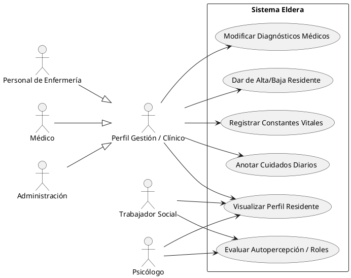
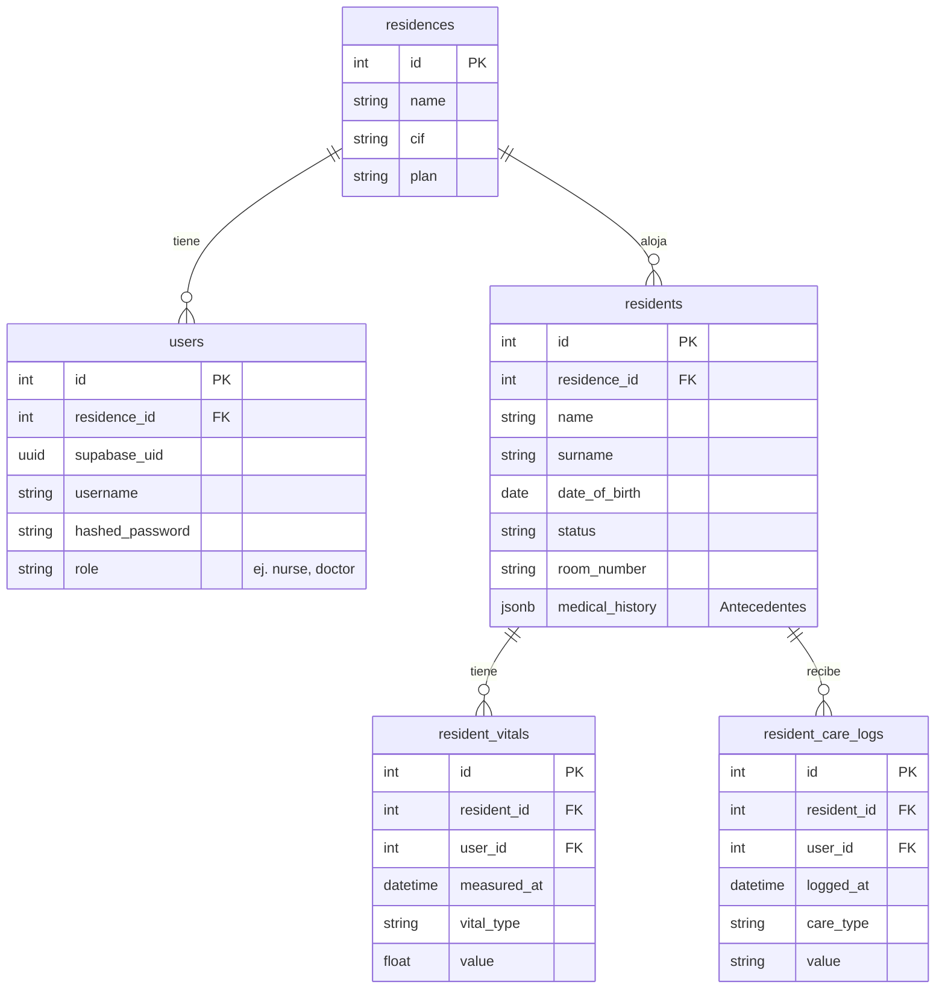
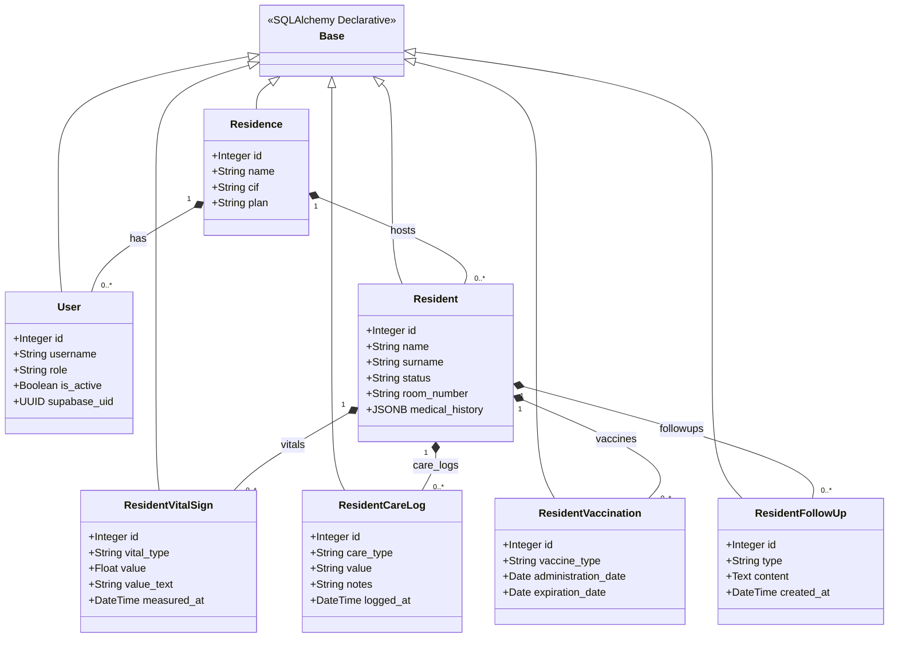
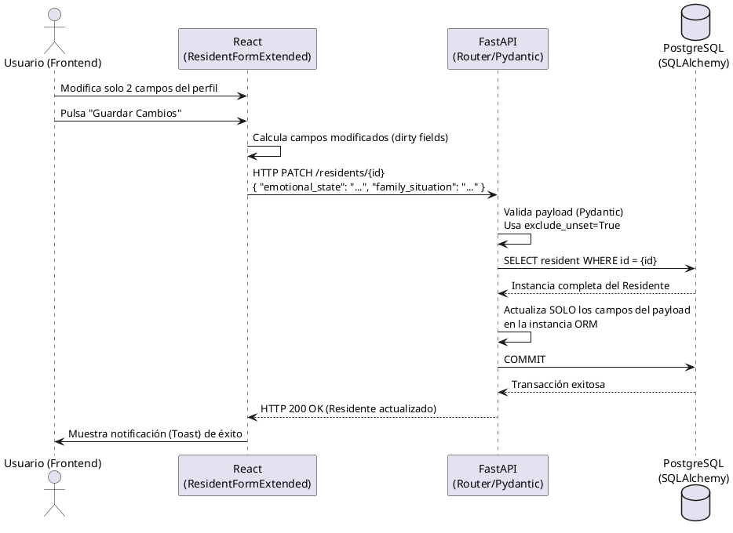
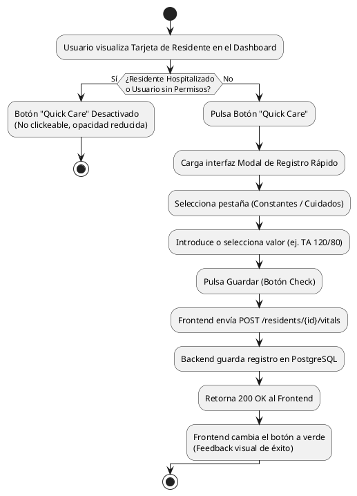
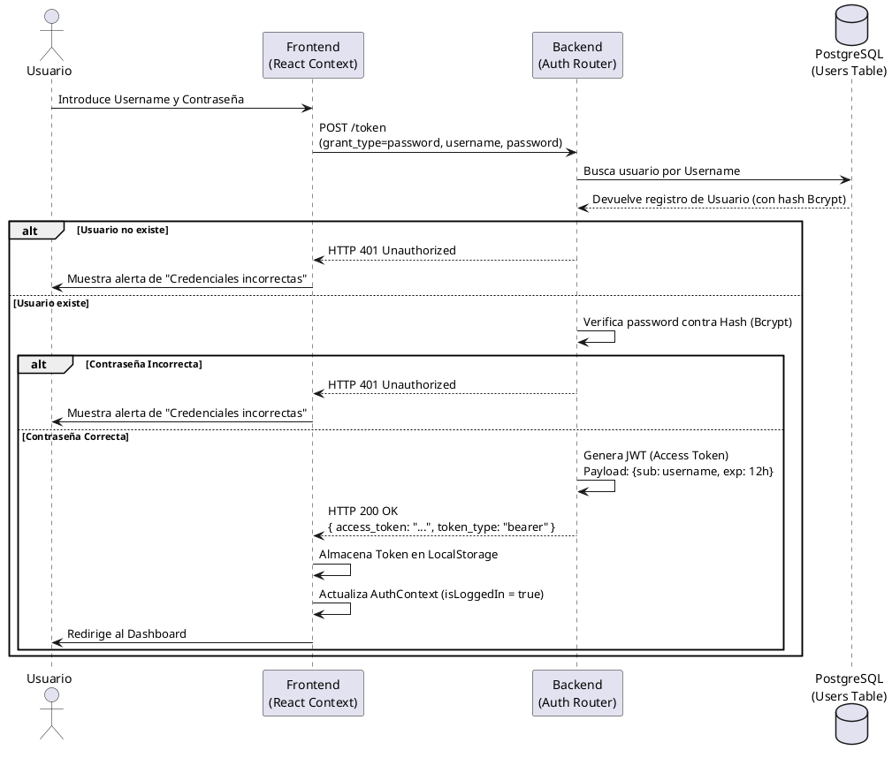

# Manual Técnico - Proyecto Eldera

**TÉCNICO SUPERIOR EN DESARROLLO DE APLICACIONES WEB**
**Departamento de Informática**

**Autor/a:** David Delgado León
**Curso Académico:** 2025/2026

---

## 1. Introducción

Eldera es una plataforma avanzada de gestión clínica y administrativa diseñada específicamente para entornos residenciales geriátricos. El objetivo de este sistema es ofrecer un núcleo de software de alta disponibilidad centrado en la seguridad del paciente y la eficiencia operativa del personal multidisciplinar.

Entre las funcionalidades principales desarrolladas se encuentran:
*   **Gestión Integral de Residentes:** Creación, edición, y seguimiento clínico basado en el marco de los 11 Patrones Funcionales de Salud de Marjory Gordon.
*   **Registro de Ingresos y Bajas:** Seguimiento del estado del residente (ingresos, bajas, hospitalizaciones) con asignación de habitaciones.
*   **Módulo Quick Care:** Una interfaz ágil diseñada para el registro en tiempo real de constantes vitales y cuidados diarios de enfermería, optimizada para pantallas móviles.
*   **Seguridad y Control de Acceso (RBAC):** Sistema granular de permisos donde todos los perfiles pueden visualizar la información clínica de forma colaborativa, pero la edición está restringida según las competencias de cada rol (ej. los auxiliares no pueden registrar constantes vitales, el perfil de Trabajo Social edita sus secciones específicas y el **Psicólogo** gestiona valoraciones cognitivas y emocionales).
*   **Interfaz de Usuario Adaptativa:** Diseño "Responsive" (adaptable a móviles y tablets) con feedback visual en tiempo real para la prevención de errores.

---

## 2. Arquitectura de la aplicación

El proyecto sigue una arquitectura Cliente-Servidor fuertemente desacoplada, donde el Frontend (SPA) se comunica con el Backend (API RESTful) exclusivamente mediante peticiones HTTP asíncronas con formato JSON.

### Estructura del Proyecto

```text
eldera-daw/
├── src/
│   ├── backend/             # Lógica API (FastAPI)
│   │   ├── alembic/         # Migraciones de base de datos
│   │   ├── routers/         # Endpoints por módulo clínico/administrativo
│   │   ├── models.py        # Esquemas base (SQLAlchemy)
│   │   ├── models_extended.py # Esquemas relacionales y clínicos
│   │   ├── schemas.py       # Validaciones Pydantic
│   │   ├── schemas_extended.py# Validaciones Pydantic extendidas
│   │   ├── permissions.py   # Lógica de autorización RBAC
│   │   ├── init_db.py       # Script de inicialización y semillas
│   │   └── main.py          # Punto de entrada de la aplicación
│   └── frontend/            # Interfaz de usuario (React)
│       ├── src/
│       │   ├── components/  # Componentes reutilizables (UI, Tarjetas, Formularios)
│       │   ├── pages/       # Vistas principales (Dashboard, Perfil, Login)
│       │   └── index.css    # Estilos globales y utilidades Tailwind
├── docker-compose.yml       # Orquestación de servicios
├── render.yaml              # Blueprint de despliegue en producción
└── pyproject.toml           # Gestión de dependencias y calidad (Ruff)
```

### 2.1. Frontend

#### 2.1.1. Tecnologías usadas
*   **React (v18 / v19):** Biblioteca principal para la construcción de interfaces de usuario mediante componentes funcionales y Hooks (`useState`, `useEffect`). **Justificación:** Elegido por su inmenso ecosistema, enorme comunidad de soporte y rendimiento óptimo en el DOM virtual, ideal para una Single Page Application (SPA) dinámica y reactiva.
*   **Vite (v7.x):** Herramienta de compilación (Bundler) ultrarrápida. **Justificación:** Se seleccionó frente a alternativas tradicionales como Webpack por sus tiempos de recarga en caliente (HMR) casi instantáneos, lo que agiliza significativamente la experiencia de desarrollo.
*   **Tailwind CSS (v4.1+):** Framework CSS basado en utilidades. **Justificación:** Permite un diseño de interfaces adaptativo ("Responsive") extremadamente rápido, manteniendo el código CSS modular y libre de archivos de estilos monolíticos.
*   **Axios (v1.x):** Cliente HTTP basado en promesas. **Justificación:** Se utilizó para estandarizar las peticiones a la API RESTful debido a su facilidad para configurar interceptores globales (esenciales para inyectar tokens JWT y manejar errores 401 de autorización) frente a *Fetch API*.
*   **Lucide React:** Librería de iconografía vectorial limpia y moderna. **Justificación:** Se seleccionó por su diseño minimalista y su peso ligero en el "bundle" final de la aplicación.

#### 2.1.2. Entorno de desarrollo
*   **Node.js (v20 LTS):** Entorno de ejecución para las herramientas de frontend.
*   **Visual Studio Code:** Editor de código principal.
*   Navegadores modernos (Chrome/Firefox) usando React Developer Tools.

### 2.2. Backend

#### 2.2.1. Tecnologías usadas
*   **FastAPI (v0.110+ / Python 3.9+):** Framework web asíncrono. **Justificación:** Se eligió por su altísimo rendimiento (basado en Starlette), soporte nativo para programación concurrente (`async`/`await`) y la generación automática de documentación interactiva (Swagger UI), facilitando la integración Frontend-Backend.
*   **SQLAlchemy (v2.0+):** ORM (Object-Relational Mapper). **Justificación:** Traduce filas de base de datos a objetos de Python de forma segura. Se utilizó para prevenir vulnerabilidades como inyecciones SQL y abstraer consultas complejas.
*   **Alembic (v1.13+):** Herramienta de migraciones de datos. **Justificación:** Integrada con SQLAlchemy, es indispensable para llevar un control de versiones de los cambios en el esquema de la base de datos a lo largo del tiempo sin pérdida de información.
*   **PostgreSQL (v15+):** Sistema de Gestión de Bases de Datos Relacional. **Justificación:** Elegido por su robustez, cumplimiento estricto del estándar ACID y soporte para tipos de datos JSON (útiles para atributos dinámicos). Es el estándar de oro en sistemas fiables de código abierto.
*   **Pydantic (v2.x):** Librería de validación y parseo de datos. **Justificación:** Garantiza mediante validación estática que todas las peticiones a la API cumplen con el formato esperado, rechazando datos corruptos o maliciosos antes de que lleguen a la base de datos.
*   **Uvicorn (v0.27+):** Servidor web ASGI. **Justificación:** Necesario para servir aplicaciones Python asíncronas, aprovechando al máximo la arquitectura orientada a eventos.

#### 2.2.2. Entorno de desarrollo
*   **uv:** Gestor de paquetes y dependencias para Python desarrollado en Rust. Seleccionado por ser significativamente más rápido que `pip`.
*   **Docker & Docker Compose:** Utilizados para crear contenedores aislados que garantizan que la aplicación corra de la misma manera en desarrollo que en producción.
*   **Ruff:** Linter y formateador de código Python extremadamente rápido para mantener el código limpio bajo el estándar PEP-8.
 
 ### 2.3. Diagrama de Despliegue (Infraestructura)
 
 El siguiente diagrama ilustra cómo se organizan los componentes del sistema y su flujo de comunicación en un entorno contenedorizado:
 
 ```mermaid
 graph TD
     Client[Dispositivos Cliente: PC / Tablet / Móvil]
     Internet((Internet))
     
     subgraph Docker_Engine [Entorno Docker / Orquestación]
         direction TB
         Frontend[Frontend: SPA React + Vite\nServido en Puerto 5180]
         Backend[Backend: API FastAPI\nServido en Puerto 8085]
         DB[(PostgreSQL 15\nPersistencia de Datos\nPuerto 5433)]
     end
     
     Client -->|HTTP / JSON| Internet
     Internet --> Frontend
     Frontend -->|Peticiones REST| Backend
     Backend -->|Mapeo ORM| DB
 ```

---

## 3. Documentación técnica

### 3.1. Requisitos del Sistema
 
 Para el diseño de Eldera se han definido los siguientes requisitos clave que garantizan la operatividad técnica y clínica:
 
 **Requisitos Funcionales (RF)**
 | ID | Título | Descripción |
 |---|---|---|
 | **RF1** | Gestión de Sesiones | El sistema permitirá a los usuarios identificarse mediante usuario y contraseña, recibiendo un token de acceso seguro (JWT). |
 | **RF2** | Gestión de Residentes | El usuario con permisos podrá Crear, Leer, Actualizar y Eliminar (CRUD) fichas de residentes. |
 | **RF3** | Búsqueda | El sistema permitirá filtrar residentes por nombre, apellido o número de habitación en tiempo real. |
 | **RF4** | Importación Masiva | El administrador podrá cargar múltiples residentes desde un archivo estándar. |
 | **RF5** | Exportación de Datos | El sistema permitirá descargar el listado actual de residentes en formato CSV o JSON (soporta PDF adicionalmente). |
 | **RF6** | Control de Acceso | El sistema restringirá ciertas acciones (como borrar residentes) únicamente a usuarios con rol de 'admin'. |
 | **RF7** | Listados Automáticos | A partir de la ficha de cada residente se podrán crear listados dinámicos que estén actualizados continuamente. |
 
 **Requisitos No Funcionales (RNF)**
 | ID | Título | Descripción |
 |---|---|---|
 | **RNF1** | Seguridad | Las contraseñas de los usuarios se almacenarán encriptadas utilizando algoritmos de hashing robustos (Bcrypt). |
 | **RNF2** | Usabilidad/Responsive | La interfaz se adaptará fluidamente a pantallas de escritorio, tablets y móviles. |
 | **RNF3** | Portabilidad | La aplicación deberá poder desplegarse en cualquier sistema operativo que soporte Docker sin necesidad de instalar dependencias locales. |
 | **RNF4** | Rendimiento | Las respuestas de la API no deberán exceder los 200ms para operaciones de lectura estándar. |
 
  **Matriz de Responsabilidades (Roles vs Funcionalidades)**
| Funcionalidad | Admin | Médico | Enfermería | Auxiliar | Fisio | T.O. | T. Social | Psicólogo |
|---|:---:|:---:|:---:|:---:|:---:|:---:|:---:|:---:|
| Gestionar Usuarios | ✓ | - | - | - | - | - | - | - |
| Ficha Identificación (Tab 0) | ✓ | - | - | - | - | - | - | - |
| Alta de Residentes | ✓ | ✓ | ✓ | - | - | - | - | - |
| Ver Perfil Clínico (Lectura) | ✓ | ✓ | ✓ | ✓ | ✓ | ✓ | ✓ | ✓ |
| Registrar Constantes (Vitals) | ✓ | ✓ | ✓ | - | - | - | - | - |
| Registrar Cuidados Diarios | ✓ | ✓ | ✓ | ✓ | - | - | - | - |
| Modificar Patrones Clínicos | ✓ | ✓ | ✓ | - | - | - | - | - |
| Movilidad y Marcha (P4) | ✓ | ✓ | ✓ | ✓ | ✓ | - | - | - |
| Cognitivo y MMSE (P6) | ✓ | ✓ | ✓ | - | ✓ | ✓ | - | ✓ |
| Adaptación y Sujeciones (P10) | ✓ | ✓ | ✓ | - | ✓ | - | - | - |
| Valoración Social (P7, P8, P11)| ✓ | ✓ | ✓ | - | - | - | ✓ | ✓ |
| Exportar Listado PDF | ✓ | ✓ | ✓ | ✓ | ✓ | ✓ | ✓ | ✓ |
| Eliminar Residente | ✓ | - | - | - | - | - | - | - |
 
 ### 3.2. Análisis (Modelo de Datos)

La aplicación parte del principio de aislar las reglas clínicas de negocio de la infraestructura tecnológica. El modelo Entidad-Relación (lógico) centraliza la tabla `Resident`, la cual tiene relaciones principales (One-to-Many) con módulos satélites:
*   `VitalSignsLog`: Almacena la historia clínica de constantes (Frecuencia Cardíaca, Tensión Arterial, Saturación de Oxígeno, etc.).
*   `CareLog`: Almacena las acciones de cuidados de enfermería diarias (Higiene, Cambios posturales, Diuresis, etc.).

Además, los datos médicos profundos y los 11 patrones funcionales se estructuran extendiendo la información del residente, y se validan en los endpoints del servidor mediante esquemas complejos de Pydantic.

### 3.1.1. Diagramas de la aplicación

*(Nota: Los siguientes diagramas están generados en sintaxis Mermaid. Si se dispone de los diagramas originales en formato de imagen desde herramientas como draw.io, se pueden sustituir estos bloques por la etiqueta de imagen correspondiente: ``)*

**Diagrama de Casos de Uso**

*Guion de exposición:*
> "Comenzamos con el **Diagrama de Casos de Uso**. Aquí podemos observar los diferentes perfiles profesionales de Eldera. Como pueden ver, el acceso a la información está democratizado: todos los roles pueden visualizar el perfil del residente.
> Sin embargo, las acciones de escritura están fuertemente tipificadas por el modelo de control de acceso basado en roles (RBAC). En nuestro sistema, tanto el perfil de **Administración** como los perfiles clínicos (**Médico** y **Enfermería**) poseen permisos totales sobre las acciones de gestión y asistenciales. Por su parte, los perfiles de **Trabajo Social** y **Psicólogo** están especializados en sus respectivas áreas funcionales (Patrones 6, 7, 8 y 11), garantizando la integridad de la historia clínica multidisciplinar."



**Diagrama Entidad-Relación (ER)**


**Diagrama de Clases (Arquitectura Backend)**

*Guion de exposición:*
> "Pasando a la arquitectura interna, este **Diagrama de Clases** refleja fielmente y de manera rigurosa el modelo de objetos principal de nuestro backend en Python (FastAPI) usando SQLAlchemy. 
> 
> Para comprender la estructura de datos, hemos definido las siguientes entidades principales:
> 
> *	`Residence`: Representa la entidad de nivel superior en nuestro sistema multi-tenancy, almacenando los datos fiscales y el plan de suscripción de cada centro residencial.
> *	`User`: Gestiona las credenciales y el control de acceso basado en roles (RBAC) de los profesionales, vinculando a cada usuario con su residencia correspondiente.
> *	`Resident`: Es el núcleo del sistema; almacena la ficha técnica, datos administrativos, antecedentes médicos y el estado actual (activo, hospitalizado, etc.) de cada usuario.
> *	`ResidentVitalSign`: Almacena la historia clínica de constantes vitales (Tensión Arterial, Frecuencia Cardíaca, Saturación de Oxígeno, Glucemia, etc.) con trazabilidad temporal.
> *	`ResidentCareLog`: Registra las acciones de cuidados diarios y necesidades básicas (Higiene, Nutrición, Diuresis, cambios posturales, etc.).
> *	`ResidentVaccination`: Detalla el plan de inmunización completo, incluyendo dosis, números de lote y fechas de vencimiento de las vacunas administradas.
> *	`ResidentFollowUp`: Centraliza las notas de seguimiento y evolución clínica cronológica escritas por los diferentes perfiles profesionales.
> 
> En el diagrama, observamos cómo todas heredan de la clase base ('Base') para su mapeo ORM. Destaca la relación de uno a muchos (1 a N) entre 'Resident' y sus entidades clínicas. Esta rigurosa normalización garantiza que un residente pueda tener infinitos registros a lo largo del tiempo sin comprometer la integridad ni la trazabilidad de su historial clínico."



*(Los siguientes diagramas están en formato PlantUML, ideal para importar en draw.io)*

**A) Diagrama de Secuencia: Actualización Parcial (Smart PATCH)**

*Guion de exposición:*
> "Si observamos el **Diagrama A**, podemos ver la secuencia del proceso que hemos diseñado bajo el concepto de *Smart PATCH*. Imaginen que un Trabajador Social entra a modificar el patrón de Autopercepción de un residente. Nuestro Frontend en React no envía todo el formulario completo, sino que calcula de forma inteligente qué campos exactos han cambiado (lo que llamamos *dirty fields*). 
>
> Al pulsar 'Guardar', se envía una petición `PATCH` solo con esos campos. Como vemos en el centro del diagrama, el Backend con FastAPI y Pydantic entra en juego utilizando la propiedad `exclude_unset=True`. Esto es fundamental: le dice al ORM de la base de datos que *únicamente* sobreescriba los datos recibidos. Si en ese preciso instante un médico está guardando nuevas alergias para el mismo residente, sus cambios no se verán machacados, resolviendo así el clásico problema de concurrencia o 'condición de carrera'. Finalmente, el proceso termina devolviendo un 200 OK y mostrando un 'Toast' verde de éxito en pantalla."



**B) Diagrama de Actividad: Registro Quick Care (Flujograma)**

*Guion de exposición:*
> "Pasando al **Diagrama B**, aquí ilustramos el flujo de la interfaz *Quick Care*, nuestro módulo rápido para el día a día. 
> 
> El flujo comienza en la propia tarjeta del listado de residentes. El sistema hace una doble comprobación inicial en el frontend: si el residente está hospitalizado o si el profesional no tiene permisos asistenciales (como sería el caso del rol de **Trabajo Social**), el botón de Quick Care aparece desactivado directamente, impidiendo clics innecesarios y guiando al usuario visualmente. 
> Si el botón está habilitado (como ocurre con los roles de **Enfermería, Médico o Administración**), el profesional entra a la interfaz modal, elige constantes o cuidados, introduce el dato y guarda. Tras la validación y registro exitoso en la base de datos PostgreSQL, la interfaz devuelve un feedback visual inmediato cambiando el botón a color verde."
> 
> *(Nota técnica: Actualmente el sistema registra el valor tal y como se introduce. Como mejora futura, se añadirá una validación en este flujo para rechazar valores clínicamente imposibles).*



**C) Diagrama de Secuencia: Autenticación JWT (Login)**

*Guion de exposición:*
> "Finalmente, en el **Diagrama C**, analizamos el corazón de la seguridad de acceso: el proceso de autenticación JWT.
> 
> El flujo inicia cuando el usuario introduce su nombre de usuario y contraseña en el Frontend. Estos datos viajan mediante un POST seguro al endpoint `/token` del Backend. FastAPI busca primero si ese nombre de usuario existe en la tabla de Usuarios. Si existe, no compara las contraseñas en texto plano (lo cual sería un riesgo crítico de seguridad), sino que utiliza la librería Bcrypt para verificar si el hash de la contraseña introducida coincide con el hash encriptado de la base de datos.
> 
> Si la comprobación es exitosa, el servidor genera un 'Access Token' (JWT) firmado con una clave secreta y un tiempo de expiración (payload). Este token se devuelve a React, donde se almacena en el estado global (Context) y en LocalStorage. A partir de este momento, en la parte final del diagrama, el usuario es redirigido al Dashboard y todas sus peticiones futuras llevarán ese token como su pasaporte de acceso."



### 3.2. Desarrollo

**Matriz de Responsabilidades (RBAC - Matriz de Trazabilidad)**

A continuación se detalla la matriz de permisos cruzada por roles y funcionalidades críticas. Esta matriz garantiza que la información asistencial esté disponible para el equipo interdisciplinar, mientras que las acciones destructivas o de configuración quedan restringidas.

| Funcionalidad | Admin | Director | Médico | Enferm. | Auxiliar | Fisio | T.O. | Trab. Soc. | Psicólogo |
| :--- | :---: | :---: | :---: | :---: | :---: | :---: | :---: | :---: | :---: |
| **Ver Perfil Residente** | ✓ | ✓ | ✓ | ✓ | ✓ | ✓ | ✓ | ✓ | ✓ |
| **Editar Datos Admin (Tab 0)** | ✓ | ✓ | ✓ | ✓ | - | - | - | - | - |
| **Registrar Constantes / Cuidados** | ✓ | ✓ | ✓ | ✓ | ✓ | - | - | - | - |
| **Evolución Médica / Enfermería** | ✓ | ✓ | ✓ | ✓ | - | - | - | - | - |
| **Valoración Funcional (Fisio/TO)** | ✓ | ✓ | - | - | - | ✓ | ✓ | - | - |
| **Valoración Social (P7, P8, P11)** | ✓ | ✓ | ✓ | ✓ | - | - | - | ✓ | ✓ |
| **Cognitivo y MMSE (P6)** | ✓ | ✓ | ✓ | ✓ | - | ✓ | ✓ | - | ✓ |
| **Configuración del Centro** | ✓ | ✓ | - | - | - | - | - | - | - |
| **Eliminar Residente (Permanente)** | ✓ | - | - | - | - | - | - | - | - |

> [!IMPORTANT]
> **Nota sobre la Eliminación:** Aunque el personal de Enfermería y Medicina puede gestionar el "Estado" del residente (ej. pasar a Hospitalizado o Defunción), el borrado permanente de la ficha (Eliminación Física) está restringido exclusivamente al rol **Administrador** por motivos de integridad legal de la historia clínica.


### 3.3. Desarrollo y Seguridad
 
 El desarrollo del API REST sigue convenciones estrictas y asíncronas para no bloquear la ejecución:
 *   **Smart PATCH (Actualizaciones Parciales):** Para la edición de perfiles, el backend expone endpoints `PATCH` que, usando `exclude_unset=True` en Pydantic, permiten actualizar solo los campos enviados desde React. Esto previene la sobreescritura accidental de datos.
 *   **Capa de Permisos (RBAC):** La aplicación cuenta con una función inyectable como dependencia en FastAPI (`has_permission`). El control de seguridad evalúa el rol del usuario (normalizado para evitar fallos tipográficos) frente a una matriz de permisos.
 *   **Seguridad y Criptografía:** 
     *   **Hasheo Bcrypt:** Las contraseñas nunca se almacenan en texto plano. Se utiliza el algoritmo *Salted Bcrypt* para garantizar que, incluso ante una fuga de datos, las credenciales sean indescifrables.
     *   **Tokens JWT (Stateless):** La sesión se gestiona mediante JSON Web Tokens. Esto permite un backend escalable que no necesita almacenar sesiones en memoria, validando la identidad del usuario en cada petición mediante la firma del token.
 *   **Componentes UI Dinámicos:** En Frontend, componentes como `ResidentFormExtended.jsx` mapean internamente mediante diccionarios qué roles pueden editar qué apartados del perfil (por ejemplo: la sección de Autopercepción está habilitada para `social_worker`, pero deshabilitada para auxiliares).

### 3.4. Pruebas realizadas

Se ha utilizado **Pytest** para la validación automática en el Backend y validaciones manuales asíncronas en el Frontend:

*   **Prueba 1: Control de Acceso (RBAC) - 403 Forbidden**
    *   **Componente / Endpoint:** `PATCH /api/v1/residents/{id}`
    *   **Juego de entrada:** Petición HTTP desde un rol técnico (ej. `social_test`) intentando modificar un parámetro restringido (constantes vitales).
    *   **Salida esperada:** Código HTTP 403 (Forbidden) con mensaje indicando falta de permisos. El frontend captura el error e impide la visualización blanca.
    *   **Herramienta:** Peticiones automáticas asíncronas (Axios / Pytest).

*   **Prueba 2: Guardado Parcial del Perfil Multidisciplinar**
    *   **Componente:** `ResidentFormExtended.jsx`
    *   **Juego de entrada:** El usuario modifica un único patrón funcional y pulsa "Guardar".
    *   **Salida esperada:** Animación de carga UI; el frontend serializa solo los campos cambiados y envía la petición HTTP PATCH; el servidor responde 200 OK y el sistema de alertas muestra un éxito visual en pantalla.
    *   **Herramienta:** React DevTools y Monitor de Red.

---

## 4. Proceso de despliegue

El proyecto está dockerizado, lo que abstrae y estandariza el proceso de despliegue en cualquier entorno compatible.

**Software Necesario:**
*   Docker Engine (20.10+ recomendado)
*   Docker Compose (v2.0+)

**Despliegue Local (Desarrollo y Testeo):**
1. Clonar el código fuente del repositorio.
2. Iniciar el entorno contenedorizado ejecutando: `docker-compose up -d --build`. Esto pondrá en marcha la Base de datos PostgreSQL, el servicio FastAPI y el entorno Vite de React.
3. Cargar la estructura de la base de datos y los datos semilla (usuarios y residentes de prueba): `docker exec -it eldera_daw_backend python src/backend/init_db.py`.
4. Acceder a la interfaz web en `http://localhost:5180`.

**Despliegue en Producción (Cloud - Render):**
La aplicación está preparada para su despliegue automatizado como Infraestructura como Código (IoC) a través del archivo `render.yaml`.
*   **Backend:** Se despliega como *Docker Web Service*.
*   **Frontend:** Se compila y sirve estáticamente para máxima eficiencia.
*   **Configuración:** Es esencial declarar en el panel del hosting las variables `DATABASE_URL` (conexión a la base de datos de producción administrada) y `SECRET_KEY`.

---

## 5. Propuestas de mejoras

Para el futuro ciclo de vida y expansión de Eldera, se proponen las siguientes actualizaciones:

1.  **Validación Clínica de Constantes Vitales:** Implementar lógica en el Backend (esquemas de Pydantic) y Frontend para validar que los valores introducidos en el módulo *Quick Care* se encuentren dentro de rangos biológicamente posibles (ej. rechazar una Tensión Arterial de 2000) y mostrar alertas preventivas ante valores anormales (ej. frecuencia cardíaca > 120).
2.  **WebSockets para Tiempo Real:** Implementación de protocolos bidireccionales con FastAPI para que las notificaciones de enfermería y nuevas lecturas de constantes aparezcan en las pantallas y tablets instantáneamente sin recargar.
3.  **Módulo PWA (Progressive Web App):** Habilitar el caché local mediante *Service Workers* en el frontend. Esta mejora es el complemento ideal para la estrategia **BYOD** (*Bring Your Own Device*) de Eldera, permitiendo que el personal use sus propios dispositivos sin instalaciones pesadas y garantizando el registro de datos en "zonas de sombra" sin Wi-Fi, sincronizando la información automáticamente al recuperar la conexión.
4.  **Integración IoT Clínica:** Consumo de datos en segundo plano a través de APIs de fabricantes de tensiómetros y pulsioxímetros bluetooth, ahorrando entrada manual de datos y previniendo errores humanos.
5.  **Generación de Informes PDF:** Desarrollo de un módulo en el backend capaz de exportar perfiles funcionales completos en un documento médico formal (PDF) para acompañar a los residentes en derivaciones hospitalarias de emergencia.

---

## 6. Bibliografía

*   Documentación oficial de **React**: [https://react.dev](https://react.dev)
*   Documentación oficial de **FastAPI** (Construcción de APIs modernas en Python): [https://fastapi.tiangolo.com](https://fastapi.tiangolo.com)
*   Documentación oficial de **SQLAlchemy** (Object Relational Tutorial): [https://docs.sqlalchemy.org](https://docs.sqlalchemy.org)
*   Documentación oficial de **Tailwind CSS**: [https://tailwindcss.com](https://tailwindcss.com)
*   *Clean Architecture* & Arquitectura Hexagonal aplicadas al ecosistema Python.
*   Marjory Gordon - Manual de Patrones Funcionales de Salud para la valoración en enfermería y trabajo social.
